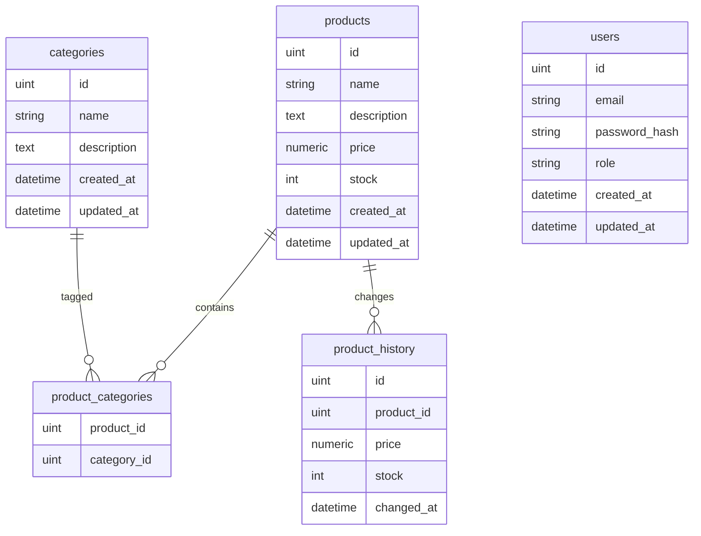

# BSMART Challenge

API REST + WebSocket para gestión de productos y categorías en Go.

## 1. Stack
- Go 1.22
- Gin (HTTP)
- GORM + PostgreSQL
- Gorilla/WebSocket
- JWT

## 2. Ejecución con Docker
1) Copiar variables:
   ```bash
   cp .env.example .env
   ```
2) Levantar API + DB (build si no existe imagen):
   ```bash
   make docker-up
   # o docker compose up --build -d
   ```
   Health check: `http://localhost:8080/health` (DB host en Compose: `db`).

## 3. Ejecución local (Go nativo, DB en Docker)
1) Copiar variables:
   ```bash
   cp .env.example .env
   ```
2) Base de datos:
   ```bash
   docker compose up -d db
   ```
3) API:
   ```bash
   make run
   ```

## 4. Endpoints principales
- Auth: `POST /api/auth/login` (JWT). Seed dev: `admin@bsmart.test` / `admin123`.
- Products: `GET /api/products`, `GET /api/products/:id`, `POST /api/products`, `PUT /api/products/:id`, `DELETE /api/products/:id`, `GET /api/products/:id/history?start=YYYY-MM-DD&end=YYYY-MM-DD`
- Categories: `GET /api/categories`, `POST /api/categories`, `PUT /api/categories/:id`, `DELETE /api/categories/:id`
- Search: `GET /api/search?type=product|category&q=&page=&page_size=&sort=`
- WebSocket: `GET /ws` (eventos `product.*` y `category.*`); Health: `GET /health`

Notas: rutas de escritura requieren rol `admin`; usuario `client` (seed) destinado a acceso de solo lectura; `page_size` máx 100; `sort` en productos `price_asc|price_desc|name_asc|name_desc|newest|oldest`, en categorías `name_asc|name_desc|newest|oldest`; historial registra cambios de `price/stock`.

## 5. Ejemplos rápidos
- Login:
  ```bash
  curl -X POST http://localhost:8080/api/auth/login \
    -H 'Content-Type: application/json' \
    -d '{"email":"admin@bsmart.test","password":"admin123"}'
  ```
- Crear producto:
  ```bash
  TOKEN=... # token de login
  curl -X POST http://localhost:8080/api/products \
    -H "Authorization: Bearer $TOKEN" \
    -H 'Content-Type: application/json' \
    -d '{"name":"Mouse","description":"Wireless","price":25.5,"stock":5,"category_ids":[1]}'
  ```
- WebSocket:
  ```bash
  wscat -c ws://localhost:8080/ws
  ```

Eventos WS (JSON): `product.created|updated|deleted` y `category.created|updated|deleted` con payload del recurso o `{id}` en deletes.

## 6. Decisiones de diseño
- Gin para ruteo/middleware; logging y recover habilitados.
- GORM + PostgreSQL con `AutoMigrate` y seed solo en `APP_ENV=development`.
- JWT HS256 para auth; rol `admin` para escritura, rol `client` de solo lectura.
- Paginación/orden estándar con límites de page_size; búsquedas simples con `ILIKE`.
- WebSocket broadcast de eventos CRUD para productos y categorías vía hub simple.
- Dockerfile + docker-compose para reproducibilidad; Makefile con comandos básicos.

## 6. Diagrama ER (Mermaid)


## 7. Variables de entorno
- `APP_ENV` (default `development`)
- `HTTP_PORT` (default `8080`)
- `DATABASE_URL` o `DB_HOST`, `DB_PORT`, `DB_USER`, `DB_PASSWORD`, `DB_NAME` (en Docker, `DB_HOST=db`)
- `JWT_SECRET`, `JWT_EXPIRATION` (default `1h`)

## 8. Deployment
- Docker (recomendado): `make docker-up` (build + app + DB).
- Local: `docker compose up -d db` + `make run`.
- Imagen manual: `make docker-build` y `docker run -p 8080:8080 --env-file .env bsmart-api:latest`.
