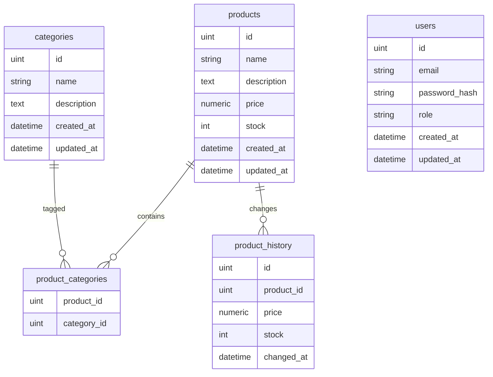

# BSMART Challenge

API REST + WebSocket para gestión de productos y categorías en Go.

## Demo en vivo
GitHub Pages (Front), AWS Lightsail (Backend): https://ignimbrite.github.io/bsmart-challenge/

## 1. Stack
- Go 1.22
- Gin (HTTP)
- GORM + PostgreSQL
- Gorilla/WebSocket
- JWT

## 2. Ejecución con Docker
1) Copiar variables:
   ```bash
   cp .env.example .env
   ```
2) Levantar API + DB (build si no existe imagen):
   ```bash
   make docker-up
   # o docker compose up --build -d
   ```

## 3. Ejecución local (Go nativo, DB en Docker)
1) Copiar variables:
   ```bash
   cp .env.example .env
   ```
2) Base de datos:
   ```bash
   docker compose up -d db
   # o docker-compose up -d db
   ```
3) API:
   ```bash
   make run
   ```

## 4. Endpoints principales
- OpenAPI (ReDoc): https://redocly.github.io/redoc/?url=https://raw.githubusercontent.com/ignimbrite/bsmart-challenge/refs/heads/main/openapi.yaml
- **Auth**: `POST /api/auth/login` — seed dev: `admin@bsmart.test` / `admin123`.
- **Productos** (GET `admin|client`; escritura `admin`):
  - `GET /api/products`
  - `GET /api/products/:id`
  - `POST /api/products`
  - `PUT /api/products/:id`
  - `DELETE /api/products/:id`
  - `GET /api/products/:id/history?start=YYYY-MM-DD&end=YYYY-MM-DD`
- **Categorías** (GET `admin|client`; escritura `admin`):
  - `GET /api/categories`
  - `POST /api/categories`
  - `PUT /api/categories/:id`
  - `DELETE /api/categories/:id`
- **Búsqueda**: `GET /api/search?type=product|category&q=&page=&page_size=&sort=` (rol `admin|client`). Para `type=category` se devuelven todas (sin paginación).
- **WebSocket**: `GET /ws` (eventos `product.*`, `category.*`) — requiere token.
- **Health**: `GET /health` (sin auth).

Notas rápidas:
- JWT obligatorio en `/api` (salvo `/auth/login`) y `/ws` (header `Authorization: Bearer` o `?token=`); lectura permite rol `admin` o `client`, escritura solo `admin`.
- Usuario seed `client@bsmart.test` pensado para lectura; `admin@bsmart.test` para CRUD.
- `page_size` máximo (productos/búsqueda): 25; `sort` en productos: `price_asc|price_desc|name_asc|name_desc|newest|oldest`; en categorías: `name_asc|name_desc|newest|oldest`.
- Categorías (`GET /api/categories`) se devuelven completas (sin paginación).
- El historial registra cada cambio de `price` o `stock`.

## 5. Ejemplos rápidos
- Login (Docker expone en puerto 80; si corres `make run` usa 8080):
  ```bash
  curl -X POST http://localhost/api/auth/login \
    -H 'Content-Type: application/json' \
    -d '{"email":"admin@bsmart.test","password":"admin123"}'
  ```
- Crear producto:
  ```bash
  TOKEN=... # token de login
  curl -X POST http://localhost/api/products \
    -H "Authorization: Bearer $TOKEN" \
    -H 'Content-Type: application/json' \
    -d '{"name":"Mouse","description":"Wireless","price":25.5,"stock":5,"category_ids":[1]}'
  ```
- Eliminar producto:
  ```bash
  TOKEN=... # token de login
  curl -X DELETE http://localhost/api/products/1 \
    -H "Authorization: Bearer $TOKEN"
  ```
- Actualizar precio/stock:
  ```bash
  TOKEN=... # token de login
  curl -X PUT http://localhost/api/products/11 \
    -H "Authorization: Bearer $TOKEN" \
    -H 'Content-Type: application/json' \
    -d '{"price":199.99,"stock":20}'
  ```
- WebSocket:
  ```bash
  TOKEN=... # token de login
  wscat -H "Authorization: Bearer $TOKEN" -c "ws://localhost/ws"
  # o bien ws://localhost/ws?token=$TOKEN
  ```

Eventos WS (JSON): `product.created|updated|deleted` y `category.created|updated|deleted` con payload del recurso o `{id}` en deletes.

## 6. Decisiones de diseño
- Gin para ruteo/middleware; logging y recover habilitados.
- GORM + PostgreSQL con `AutoMigrate` y seed solo en `APP_ENV=development`.
- JWT HS256 para auth; rol `admin` para escritura, rol `client` de solo lectura.
- Paginación/orden estándar en productos y búsquedas de productos; categorías retornan todas en una llamada (incluye búsqueda de categorías); búsquedas simples con `ILIKE`.
- WebSocket broadcast de eventos CRUD para productos y categorías vía hub simple.
- Dockerfile + docker-compose para reproducibilidad; Makefile con comandos básicos.

## 7. Diagrama ER (Mermaid)


## 8. Variables de entorno
- `APP_ENV` (default `development`)
- `HTTP_PORT` (default `8080`)
- `DATABASE_URL` o `DB_HOST`, `DB_PORT`, `DB_USER`, `DB_PASSWORD`, `DB_NAME` (en Docker, `DB_HOST=db`)
- `JWT_SECRET`, `JWT_EXPIRATION` (default `1h`)
- `WS_ALLOWED_ORIGINS`

## 9. Deployment
- Docker (recomendado): `make docker-up` (build + app + DB).
- Local: `docker compose up -d db` + `make run`.
- Imagen manual: `make docker-build` y `docker run -p 8080:8080 --env-file .env bsmart-api:latest`.
